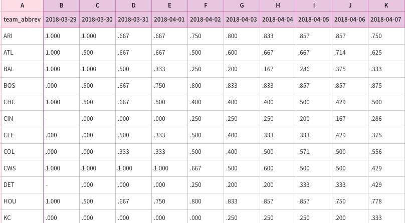

# MLB Horserace


Heavily inspired by [Mara Averick's NBA Horserace plot](https://maraaverick.rbind.io/2018/04/nba-horserace/#fnref1) who in turn was inspired by [Laura Ellis](https://www.littlemissdata.com/blog/data-storytelling), I implemented the MLB standings in a horserace plot, thanks to [Flourish](https://flourish.studio)'s awesome tool that makes data visualization super easy and convienent. 

tl;dr Use Flourish - plotting animated horse racing plots is not easy.

## Attempt 1 - Using Flourish

Similar to Mara, the hardest part was getting the data to be in a tabular format. Instead of using the typical `httr` package for sending REST requests, I opted to use the super easy `curlconverter` package and generalized it to accept any date. Once I had the data, it was a matter of filtering and reshaping it into the tabular format that Flourish requires. 

This was mainly done by the function below (note some headers removed for simplicity):

```R
get_standings_by_date <- function(date) {
  cmd <- glue("curl 'http://lookup-service-prod.mlb.com/lookup/json/named.historical_standings_schedule_date.bam?\\
            season={format(game_date, '%Y')}&\\
              game_date=%27{format(game_date, '%Y/%m/%d')}%27&\\
              sit_code=%27h0%27&\\
              league_id=103&\\
              league_id=104&\\
              all_star_sw=%27N%27\\
              &version=48' \\
  
  straight <- straighten(cmd)
  
  res <- make_req(straight)
  json_response <- toJSON(content(res[[1]](), as="parsed"), auto_unbox = TRUE, pretty=TRUE)
  parsed <- fromJSON(json_response)
  
  leagues <- parsed$historical_standings_schedule_date$standings_all_date_rptr$standings_all_date
  leagues.al <- leagues$queryResults$row[[2]] # League id 104 == AL
  leagues.nl <- leagues$queryResults$row[[1]] # League id 103 == NL
  leagues.merged <- rbind(leagues.al, leagues.nl)
  data <- leagues.merged %>%
    select(team_abbrev, w, l, pct, playoff_odds) %>%
    arrange(team_abbrev)
  return(data)
}
```

Resulting in the following CSV format:


This allowed us to upload it directly to Flourish. The team colours were set by identifying the primary hex colour of each team then making a comma seperated list of the colours in the order of the team abbreviations (i.e. original upload order).


The full, interactive plot is available here: [https://public.flourish.studio/visualisation/61795/](https://public.flourish.studio/visualisation/61795/)

Once again, thanks to Mara for the inspiration.

## Attempt 2 - Animating using gganimate

To plot this ourselves, we first need to tidy the data by "melting" it from a wide structure to a tall structure. Luckily, this is simple with the `reshape2` package:

```R
season.melt <- melt(season, id.vars = c("team_abbrev","image_url", "color"), 
                    variable.name = "date",
                    value.name = "pct")
```
The new field `"date"` was then converted to a date field: `season.melt$date <- as.Date(season.melt$date)`.

Thus, the data now has an individual row for each team and each date. See below for what this looks like.


Then we're able to pass this directly into `ggplot`:

```R
ggplot(season.melt, aes(x=date, y=pct, group=team_abbrev, color=team_abbrev, 
                              fill=color, frame=date, cumulative=TRUE)) + 
  geom_line() +
  # Title Label and Legend Label
  labs(title = "Horse Race", color = "Team") +
  # Show a label every 3 weeks
  scale_x_date('Standings as of', date_breaks = '3 weeks', date_labels = '%m/%d') +
  # Set the color of the teams to the team's primary color
  scale_color_manual(breaks = season.colors$team_abbrev, values = season.colors$color)
```

This then results in the following plot:


[A larger plot is viewable here](static/hr.mp4).

Although this works, it is not pretty and is much more difficult than using the tool.

**Disclaimer**: I was not paid in any way for this article. Just really liked using Flourish.